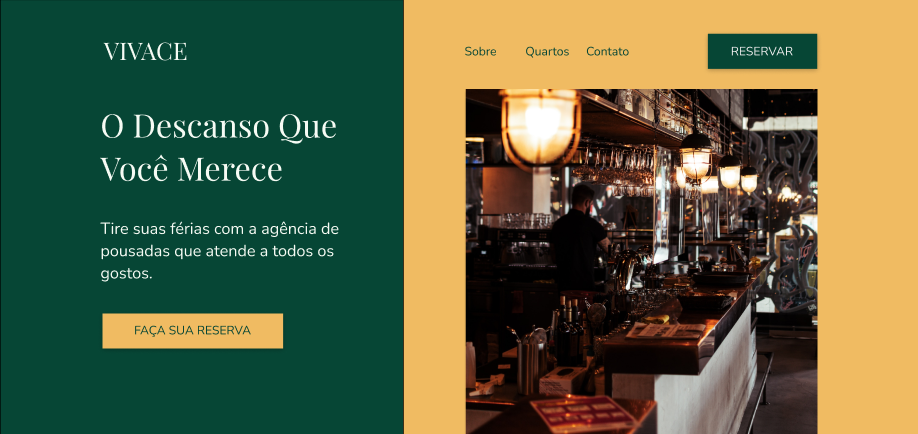

# 🏨 Vivace Hotels



Projeto desenvolvido com o objetivo de praticar **UI/UX Design**, prototipação no **Figma** e desenvolvimento front-end moderno utilizando **React**, **TypeScript** e **Vite**.

A aplicação consiste em uma landing page institucional para a rede fictícia de pousadas **Vivace Hotels**, inspirada na arquitetura, hospitalidade e paisagens naturais da Serra Catarinense.

O projeto teve como principal objetivo transformar um protótipo criado no Figma em uma aplicação funcional, explorando conceitos de componentização, responsividade, organização visual e boas práticas de desenvolvimento front-end.

---

# 📖 Índice

- [Sobre o Projeto](#sobre-o-projeto)
- [Objetivos](#objetivos)
- [Protótipo no Figma](#protótipo-no-figma)
- [Funcionalidades](#funcionalidades)
- [Estrutura da Página](#estrutura-da-página)
- [Tecnologias Utilizadas](#tecnologias-utilizadas)
- [Estrutura do Projeto](#estrutura-do-projeto)
- [Instalação](#instalação)
- [Autor](#autor)

---

# 📌 Sobre o Projeto

A **Vivace Hotels** é uma landing page institucional desenvolvida para uma rede fictícia de pousadas localizadas no estado de Santa Catarina.

O projeto foi concebido inicialmente como um exercício de design de interfaces no Figma e posteriormente implementado utilizando React, TypeScript e Vite.

Durante seu desenvolvimento foram aplicados conceitos relacionados a:

- Design de Interfaces (UI);
- Experiência do Usuário (UX);
- Responsividade;
- Componentização;
- Arquitetura Front-End;
- Organização de estilos com SCSS;
- Desenvolvimento utilizando TypeScript.

---

# 🎯 Objetivos

Este projeto foi criado para exercitar conhecimentos nas áreas de design e desenvolvimento front-end.

### UI Design

- Hierarquia visual;
- Composição de layouts;
- Tipografia;
- Paleta de cores;
- Espaçamento e alinhamento.

### UX Design

- Navegação intuitiva;
- Organização de conteúdo;
- Estruturação de landing pages;
- Fluxos de interação simples.

### Desenvolvimento Front-End

- React com TypeScript;
- Componentização;
- Estruturação de projetos;
- Responsividade;
- Integração de bibliotecas externas.

---

# 🎨 Protótipo no Figma

O wireframe e protótipo visual utilizado como base para o desenvolvimento podem ser acessados através do link abaixo:

🔗 https://www.figma.com/file/YthDo58TItOrjkhOk11nlf/Vivace-Hotels

---

# ✨ Funcionalidades

- Landing page institucional
- Seção de apresentação da marca
- Navegação simplificada
- Destaque para acomodações
- Galeria de imagens
- Carrossel utilizando SplideJS
- Área de benefícios da hospedagem
- Formulário de contato
- Layout responsivo
- Componentização em React
- Estrutura tipada com TypeScript

---

# 🖥️ Estrutura da Página

A aplicação foi organizada em múltiplas seções para simular a experiência de navegação em um site real de hospedagem.

## Hero Section

Área principal da página responsável pela apresentação da marca.

Contém:

- Nome da pousada;
- Slogan;
- Descrição institucional;
- Botão de reserva;
- Imagem de destaque.

---

## Sobre Nós

Seção dedicada à apresentação da rede Vivace Hotels.

Apresenta:

- Informações institucionais;
- Localização;
- História fictícia da empresa;
- Diferenciais da hospedagem.

---

## Quartos

Área destinada à apresentação das acomodações.

Contém:

- Fotografias dos quartos;
- Destaques visuais;
- Informações resumidas.

---

## Benefícios

Exibe vantagens oferecidas aos hóspedes.

Exemplos:

- Café da manhã incluso;
- Diversas formas de pagamento;
- Alta taxa de satisfação dos clientes.

---

## Contato

Área destinada à comunicação com potenciais clientes.

Campos:

- Nome;
- E-mail;
- Mensagem.

---

# 🛠️ Tecnologias Utilizadas

## React

Biblioteca utilizada para construção da interface da aplicação.

Documentação:

https://react.dev

---

## TypeScript

Superset do JavaScript utilizado para adicionar tipagem estática ao projeto.

Documentação:

https://www.typescriptlang.org

---

## Vite

Ferramenta responsável pelo ambiente de desenvolvimento e geração da build.

Documentação:

https://vitejs.dev

---

## SCSS

Pré-processador CSS utilizado para organização e manutenção dos estilos.

Documentação:

https://sass-lang.com

---

## SplideJS

Biblioteca utilizada para criação de sliders e galerias de imagens.

Documentação:

https://splidejs.com

---

## Feather Icons

Biblioteca de ícones leves utilizada na interface.

Documentação:

https://feathericons.com

---

## ESLint

Ferramenta responsável pela padronização e análise estática do código.

Documentação:

https://eslint.org

---

# 📂 Estrutura do Projeto

```text
vivace-hotels/
│
├── dist/
│
├── node_modules/
│
├── src/
│   │
│   ├── assets/
│   │
│   ├── components/
│   │
│   ├── frames/
│   │
│   ├── images/
│   │
│   ├── App.tsx
│   ├── main.tsx
│   ├── react-splide.d.ts
│   └── vite-env.d.ts
│
├── styles/
│
├── .eslintrc.cjs
├── .gitignore
├── index.html
├── package-lock.json
├── package.json
├── README.md
├── tsconfig.json
├── tsconfig.node.json
└── vite.config.ts
```

## Descrição das Pastas

| Pasta | Finalidade |
|---------|---------|
| `assets/` | Recursos estáticos utilizados pela aplicação |
| `components/` | Componentes reutilizáveis da interface |
| `frames/` | Seções estruturais da landing page |
| `images/` | Imagens utilizadas no projeto |
| `styles/` | Arquivos SCSS e estilos globais |
| `dist/` | Build de produção gerada pelo Vite |

---

# 🚀 Instalação

Clone o repositório:

```bash
git clone https://github.com/odavibatista/vivace-hotels.git
```

Entre na pasta do projeto:

```bash
cd vivace-hotels
```

Instale as dependências:

```bash
npm install
```

Execute o ambiente de desenvolvimento:

```bash
npm run dev
```

A aplicação ficará disponível em:

```text
http://localhost:5173
```

---

# 📦 Scripts Disponíveis

Executar ambiente de desenvolvimento:

```bash
npm run dev
```

Gerar build de produção:

```bash
npm run build
```

Visualizar build localmente:

```bash
npm run preview
```

Executar ESLint:

```bash
npm run lint
```

---

# 👨‍💻 Autor

Desenvolvido por:

**Davi Batista**

GitHub:

https://github.com/odavibatista

LinkedIn:

https://linkedin.com/in/odavibatista

---

# 📄 Licença

Projeto desenvolvido para fins educacionais, com foco em aprendizado de UI/UX Design, prototipação no Figma e desenvolvimento Front-End moderno utilizando React e TypeScript.